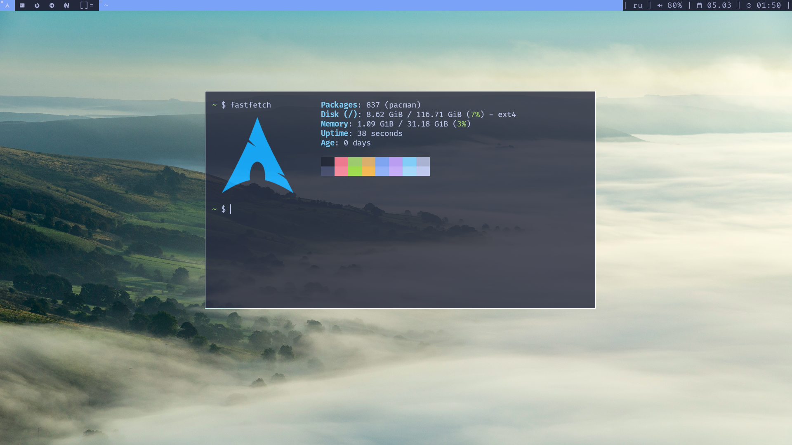
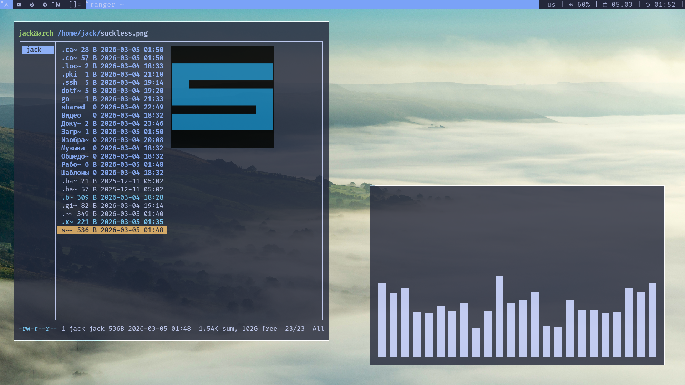
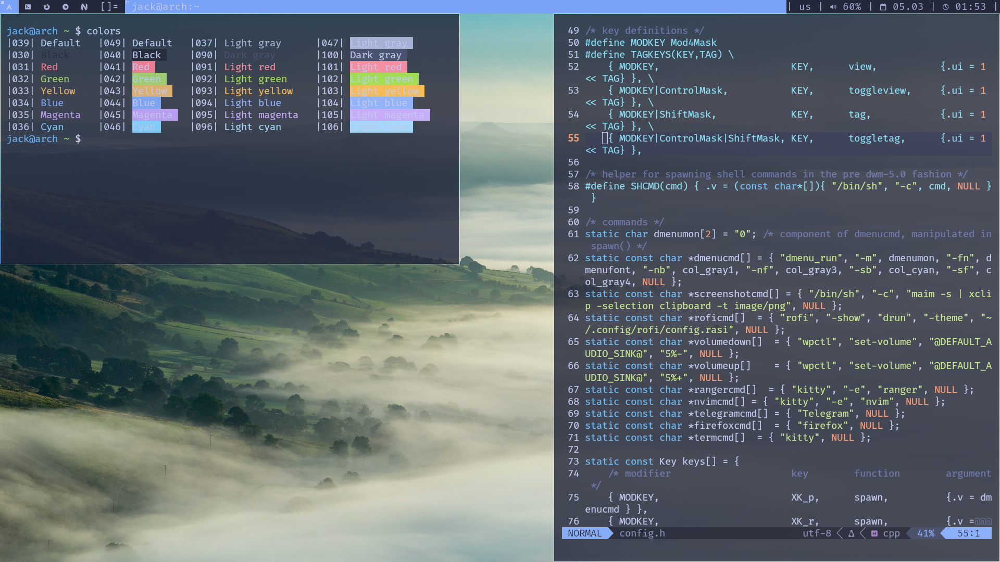

# Arch Linux – DWM Tokyo Night Dotfiles








## Installation

```sh
git clone https://github.com/d9-pub/dotfiles.git

cd dotfiles/installation/

./packages.sh # dependencies

cd ..

stow . # creating symlinks
```

> **Note:** Compile the contents of the `build` folder:
> ```sh
> sudo make clean install
> ```
